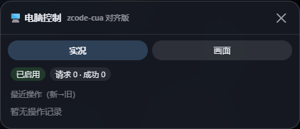
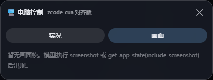
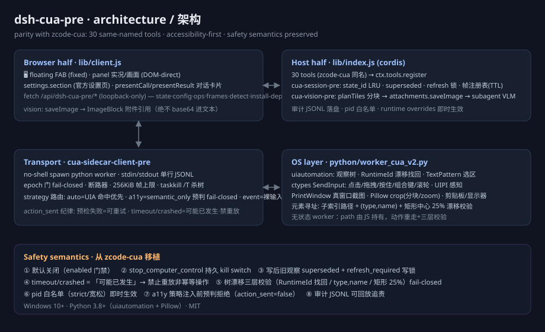

<div align="center">

# 🖥️ dsh-cua-pre

**Computer Use for DeepSeek Harness — accessibility-first desktop automation**
**DeepSeek Harness 电脑控制插件 — 无障碍优先的桌面自动化**

[](https://www.npmjs.com/package/@a9i5k4/dsh-cua-pre)
[](./LICENSE)
[](#requirements--环境要求)
[](#requirements--环境要求)
[](#tools--工具一览)

**One command install · 一条命令安装**

```powershell
irm https://raw.githubusercontent.com/Aik358/dsh-cua-pre/main/install.ps1 | iex
```

</div>

---

English | [中文](#中文)

## What is this

A self-built computer-use plugin for [DeepSeek Harness](https://github.com/deepseek-ai/deepseek-harness): an **accessibility-first** observe → act → verify loop with 30 desktop-automation tools (the same names you'd expect from an industry-standard Computer Use toolset), full safety semantics, reimplemented on a Windows Python worker.

The agent operates your desktop the way a careful human would: it **reads the UI Automation tree first** (exact, focus-free, resolution-independent) and only falls back to pixel coordinates when the tree cannot express a target. Screenshots are a describing aid, never the operating premise.

<p align="center">
  
  
</p>
<p align="center"><sub>The floating panel: live operation feed (left) and captured frame wall (right). FAB sits at the bottom-right corner, decoupled from any sidebar layout.</sub></p>

## Highlights

- **30 tools, standard names** — `get_app_state` / `left_click` / `type` / `key` / `scroll` / `screenshot` / `zoom` / `clipboard` … with `element`/`coordinate` dual targets, `auto`/`a11y`/`event` strategy routing, and `return_state`.
- **Safety semantics ported, not improvised** — observations are invalidated after every mutation (`superseded` + refresh lock); timeouts mean *"may have happened"* and are never replayed blindly; `stop_computer_control` is a **persistent** kill switch; element addressing validates RuntimeId / type+name / rect drift and fails closed (`stale_tree`) instead of clicking the wrong thing.
- **Presentation layer** — tool calls render as chat cards; a fixed floating panel shows the live operation feed and a wall of captured frames; a dedicated settings page with **environment auto-detection** (Python candidates probed for real, one-click dependency install, bundled worker auto-resolve, vision-model dropdown with heuristic vision flags).
- **Tiled vision for small-resolution models** — screenshots are grid-tiled (≤768 px per tile, overlap, capped count) so DeepSeek-flash-class models can still read the screen; full-frame and per-tile caches make repeated looks nearly free; images travel as durable attachment refs, never base64 in text.
- **Governance** — append-only JSONL audit trail of every tool call; pid allowlist (strict/relaxed) with instant effect; loopback-only HTTP surface.

## How it works

```text
Browser half (lib/client.js)          Host half (lib/index.js, cordis)
  floating FAB + fixed panel    ──►    30 tools · session state machine
  settings page · chat cards           frame registry · vision tiling · audit
            │                                   │
            └── /api/dsh-cua-pre/* ◄────────────┘
                                                │ stdio JSONL (epoch gate, breaker)
                                                ▼
                                python/worker_cua_v2.py
                        UIA tree · SendInput · PrintWindow · Pillow crop
```



**Element addressing** records a child-index path at observe time and re-walks it at action time, validating three layers: UIA RuntimeId (with bounded BFS recovery), `type`+`name`, and rect-center drift (±25 % tolerance). Any mismatch raises `stale_tree` — the agent re-observes instead of guessing.

**Strategy routing**: `auto` tries a UIA hit-test at the coordinate first and only clicks raw when nothing actionable is found; `a11y` refuses *before* any injection when the hit-test misses (`action_sent=false`); `event` forces raw input.

## Quick start

> Prerequisites: Windows 10+, [DeepSeek Harness](https://github.com/deepseek-ai/deepseek-harness) (`dsh web`), Python 3.9+ on PATH.

```powershell
# 1) install into the web profile + patch the bundle roster
irm https://raw.githubusercontent.com/Aik358/dsh-cua-pre/main/install.ps1 | iex

# 2) restart `dsh web` (port 3080 stays a manual, user-owned step)

# 3) enable + (recommended) point the plugin at a venv with worker deps
#    ~/.dsh/cua-pre.json
{ "enabled": true, "pythonExecutable": "C:/path/to/venv/Scripts/python.exe" }
```

Or pick the interpreter visually: after restart, open **Settings → 电脑控制** — the page auto-probes every candidate Python, shows which ones have `uiautomation`+`pillow` ready, installs missing deps in one click (official PyPI, Tsinghua mirror fallback), and lets you switch with one click (takes effect immediately, no restart).

<details>
<summary><b>Enable vision (optional) / 开启识图（可选）</b></summary>

```json
{ "visionEnabled": true, "visionModel": "" }
```

`visionModel` left empty follows the harness default route; the settings dropdown lists every configured provider's models with a heuristic ✔ on likely-vision names (you can override manually). Every `screenshot` / `get_app_state(include_screenshot)` then appends a `[vision]` description built from grid tiles — each tile small enough for low-resolution models to read faithfully.

Install worker deps for the chosen interpreter: `pip install uiautomation pillow` (or use the settings page button).

</details>

## Tools — 30 desktop-automation tools

| Group | Tools |
|---|---|
| Observe & resolve | `request_access` `list_apps` `open_application` `list_windows` `get_app_state` `screenshot` `zoom` `list_displays` `switch_display` `cursor_position` |
| Pointer | `left_click` `double_click` `triple_click` `right_click` `middle_click` `scroll` `left_click_drag` `mouse_move` `left_mouse_down` `left_mouse_up` |
| Keyboard | `type` `set_value` `select_text` `key` `hold_key` |
| Semantic | `perform_action` |
| Runtime | `stop_computer_control` `wait` `read_clipboard` `write_clipboard` |

Tool calls render as **chat cards** in the harness UI, and every completed screenshot can embed itself into its card as an image block (UI-facing only — zero model-context cost).

## Safety model

| Mechanism | Behavior |
|---|---|
| Default off | zero Python processes until `enabled: true` |
| Kill switch | `stop_computer_control` persists across restarts; restore = remove `stoppedByUser` from config + restart |
| Write invalidation | any click/type/key supersedes all observations of that window and locks writes until a fresh `get_app_state` |
| No blind replay | timeout/crash on a mutating call ⇒ "may have happened" ⇒ the agent must re-observe first |
| Fail-closed addressing | `stale_tree` on RuntimeId/type/name/rect drift; `a11y` strategy refuses pre-injection |
| UIPI | injection into elevated windows is rejected by Windows with a structured error, never a crash |
| Audit | every tool call appended to `artifactsDir/audit/YYYY-MM-DD.jsonl` |
| Allowlist | `allowedPids` restricts which processes may be observed/operated; strict mode also blocks raw coordinates, clipboard and full-screen capture |

## For developers

```powershell
git clone https://github.com/Aik358/dsh-cua-pre && cd dsh-cua-pre
python -m venv .venv && .venv\Scripts\pip install -r python\requirements.txt
node scripts/test-v2-gate.mjs                          # unit: gate/session/frame/tile planner
node scripts/test-v2-live.mjs .venv\Scripts\python.exe # live read-only chain, 22 asserts
node scripts/test-vision.mjs .venv\Scripts\python.exe  # vision pipeline vs fake host services
node scripts/test-m4.mjs .venv\Scripts\python.exe      # card-image/cache/audit/allowlist, 17 asserts
```

All tests are strictly read-only on the desktop — no test ever injects input.

## Notes & honest limitations

- Windows only (UIA + SendInput). macOS/Linux are out of scope for now.
- Frame-bound coordinates are *soft-bound*: pixels from an expired frame are accepted but flagged `stale` (hard rejection needs broker-level occlusion tracking).
- `bundle_id` (UWP/AUMID) is not supported — use `name` or `pid`.
- Vision is a **describe enhancement**, never the operating premise — positioning always comes from the accessibility tree, which is exactly why the plugin stays reliable even with vision off.

## 中文

面向 DeepSeek Harness 的桌面自动化自研插件：**30 个标准工具**（元素/坐标双目标、auto/a11y/event 策略路由、return_state）、无障碍树优先的观察-动作-验证回路、写后作废与禁重放安全语义、持久急停开关、RuntimeId+矩形漂移双层防错位、对话卡片 + 右下角悬浮面板（实况/画面）+ 环境自动检测设置页、面向低分辨率模型的分块识图（全帧/分块两级缓存）、JSONL 审计落盘与 pid 白名单。

安装与启用见顶部一条命令；仅在 Windows 10+ 可用；默认关闭。安全机制一览见 [Safety model](#safety-model)。

## License

MIT — see [LICENSE](./LICENSE).
